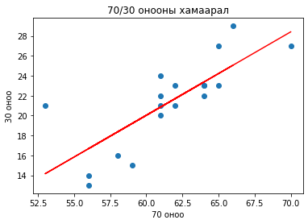

# Мэргэжлийн удиртгал - 1кр

“Электроник, микроэлектроник - 2” хичээл нь “Цахилгаан системийн автоматжуулалт” хөтөлбөрийн бакалаврын сургалтын төлөвлөгөөнд тусгагдсан мэргэшүүлэх хичээл бөгөөд энэхүү хичээлд Энэ хичээлээр тоон электроникийн үндэс, булийн алгебрийн хуулиуд, тоон электроник схем, түүний хэрэглээ загварчлал. Тоон техникийн үндэс, интеграл схемийн ажиллах зарчим, тоон электроникийн үндсэн зарчмыг цаашид бие даан гүнзгийрүүлж судлаж эзэмших, тоон интеграл схемийг ашиглан хялбар багаж хэрэгсэл зохион бүтээх туших засварлах чадвар эзэмшүүлнэ. 

## Plan - Төлөвлөлт
| Долоо/ хоног | Хичээлийн сэдэв                                                                                                | Лекц | Сем  | Лаб |
|--------------|----------------------------------------------------------------------------------------------------------------|------|------|-----|
| I            | Тоон электроник ба аналог электроник, тооллын системийн үндсэн ойлголт, тооллын системүүдийн хооронд хөрвүүлэх | 2    |      |     |
| II           | Логик хэлхээнүүд болон логик элементүүдийн бүтэц, ажиллах зарчим, үнэний хүснэгт                               | 2    |      |     |
|              | Логик элементүүдийн хялбар хийц, үнэний хүснэгт гарган авах хэмжилт тооцоо                                     |      |      | 4   |
| III          | Логик илэрхийлэл хялбарчлах Булийн альгебр Деморганы теорем                                                    | 2    |      |     |
| IV           | Хувилбарт буюу зэрэгцээ логик хэлхээг зохиох                                                                   | 2    |      |     |
|              | Тооллын систем, 7 сегментийн дэлгэц дээр өгөгдөл гаргах BCD тоо болон 7447 микросхем судлах                    |      |      | 4   |
| V            | Логик гейтээр дохиог удирдах, хоёртын нийлбэрлэгч хэлхээг турших                                               | 2    |      |     |
| VI           | Карно карт ашиглан логик илэрхийлэл хялбарчлах аргууд                                                          | 2    |      |     |
|              | Булын хууль ба Деморганы теоремийн гаргалгаа болон бодит схемээр туршиж ажиллуулах                             |      |      | 4   |
| VII          | Декодер (код тайлагч) болон енкодерийн (кодлогч) бүтэц, ажиллах зарчим, хэрэглээ                               | 2    |      |     |
| VIII         | Сэлгэн залгагч мультиплексор, демультиплексор бүтэц, ажиллах зарчим, хэрэглээ                                  | 2    |      |     |
|              | Логик хэлхээг хялбарчлах аргууд тэдгээрийг ашиглан логик илэрхийллийг хялбарчлах энгийн схем зохиох            |      |      | 4   |
| IX           | Санамжтай логик буюу цуваа логик хэлхээ бүтэц, ажиллах зарчим, хэрэглээ                                        | 2    |      |     |
| X            | Асинхрон болон синхрон тоолуурын бүтэц, ажиллах зарчим, хэрэглээ                                               | 2    |      |     |
|              | Мультиплексор хэрэглэсэн логикийн бүтэц, ажиллах зарчим, хэрэглээ                                              |      |      | 4   |
| XI           | Шилжилтийн регистрийн бүтэц, ажиллах зарчим, хэрэглээ                                                          | 2    |      |     |
| XII          | Тоон интеграл микросхемийн бүтэц, ажиллах зарчим, хэрэглээ                                                     | 2    |      |     |
|              | D лач ба флип-флопын бүтэц, ажиллах зарчим, хэрэглээ                                                           |      |      | 4   |
| XIII         | Хосолмол метал-исэл-хагасдамжуулагч логик схем түүний давуу тал                                                | 2    |      |     |
| XIV          | Транзистор транзисторын логик                                                                                  | 2    |      |     |
|              | J-K флип-флопын бүтэц, ажиллах зарчим, хэрэглээ                                                                |      |      | 4   |
| XV           | Тоон-аналог хувиргагчийн бүтэц, ажиллах зарчим, хэрэглээ                                                       | 2    |      |     |
| XVI          | Аналог-тоон хувиргагчийн бүтэц, ажиллах зарчим, хэрэглээ                                                       | 2    |      |     |
|              | Синхрон тоолуурын бүтэц, ажиллах зарчим, хэрэглээ                                                              |      |      | 4   |
## Do - хэрэгжүүлэлт
### Ном сурах бичиг
1. Бат-Отгон.Б, нар. “Электроникийн үндэс.” УБ., 2012
2. Paul Horowitz, Winfield Hill. “The Art of Electronics.” Cambridg University press.
3. Э.Дамдинсүрэн нар. “Электроникийн үндэс. Лабораторын хичээлийн гарын авлага.” 2002,... 2006
4. Floyd, Thomas L. “Electronic devices : conventional current version”.— 9th ed.
5. Ревич Ю.В. Занимательная электроника. 2009 он 

### Лекцийн хичээл
Peer instruction аргаар лекцийн хичээлийг явуулж байна.
### Лабораторийн хичээл
```{figure} /elec2breadB.jpeg
---
name: elec2breadB
---
Оюутнуудын хичээл дээр туршилт хийж буй байдал
```

```{figure} /elec2breadB2.jpeg
---
name: elec2breadB2
---
Оюутнуудын хичээл дээр туршилт хийж буй байдал
```

## Check - Шалгах
```python
import numpy as np
import matplotlib.pyplot as plt

dataset = pd.read_csv('student_scores.csv')

x = np.array(dataset.loc[:,"base"])
y = np.array(dataset.loc[:,"exam"])

plt.scatter(x, y)

z = np.polyfit(x, y, 1)
p = np.poly1d(z)

plt.plot(x, p(x), color='red')
plt.title('70/30 онооны хамаарал')
plt.xlabel('70 оноо')
plt.ylabel('30 оноо')
plt.show()
```


    

    


```python
np.corrcoef(x, y)
```


    array([[1.        , 0.77627576],
           [0.77627576, 1.        ]])

## Act - сайжруулалт

```{Note}
Лабораторийн хичээл ороход цаг их зарцуулдаг лаборант элементүүдээ урьдчилан бэлтгэх шаардлагатай. Элементүүдийг ангилан ялгах сав хэрэгтэй. 
```

```{figure} elecTable.jpeg
---
name: elecTable
---
Элементүүдийг ангилан ялгах сав
```